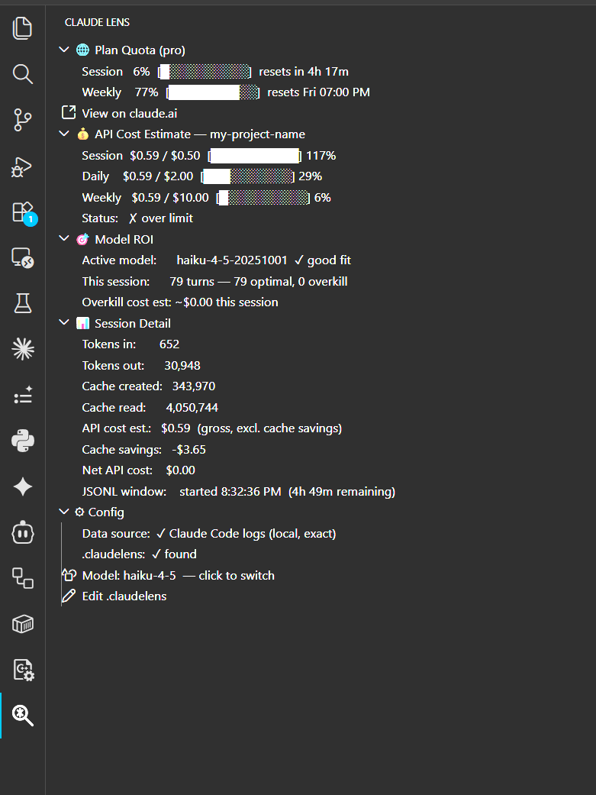
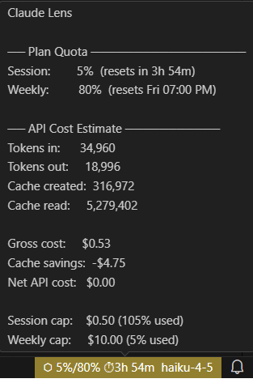

# Claude Lens

> **Real-time Claude usage intelligence for VS Code — know your session limits before they hit you.**

A VS Code extension that shows your actual Claude Pro/Max subscription usage (session %, weekly %), live in the sidebar — the same numbers on [claude.ai/settings/usage](https://claude.ai/settings/usage), without switching windows.

Everything runs locally. Zero telemetry.

## Features at a glance

| Feature | What you see |
|---|---|
| **Plan Quota** | Live session % and weekly % from claude.ai/settings + per-turn quota consumption breakdown |
| **Plan Quota Alerts** | Proactive toasts at 80% and 90% of session limit, with countdown to reset |
| **Per-Turn Quota Tracking** | Each response shows what % of session quota it consumed (color-coded: green <10%, amber 10-25%, red >25%) |
| **API Cost Estimate** | Per-session, daily, weekly spend vs. configurable caps (useful for API users) |
| **Model ROI** | Complexity scoring for each turn; smart suggestions to downgrade models; cumulative overkill cost tracking |
| **Model Switching** | Switch models (Haiku/Sonnet/Opus) instantly without restarting — saved in ~/.claude/settings.json |

## UI Overview



The sidebar shows:
- **Plan Quota** — real subscription usage % (session + weekly) with per-turn consumption breakdown
- **API Cost Estimate** — collapsed by default for Pro/Max users
- **Model ROI** — active model tier, complexity assessment, overkill detection + projected savings
- **Session Detail** — token counts (input, output, cache), costs, turn count, reset timer
- **Config** — data source, model switcher, budget settings



The status bar displays: quota %, time until reset, and active model. Click to focus the sidebar.

## How it works

**Three data sources** (work independently):

1. **Claude Code Logs** (primary)
   - Local JSONL files in `~/.claude/projects/`
   - Token counts & costs from actual API responses
   - No setup required

2. **Plan Quota** (automatic for Claude Code users)
   - OAuth token from `~/.claude/.credentials.json` (managed by Claude Code)
   - Session % and weekly % from Anthropic (same as claude.ai/settings)
   - Polls every 15 minutes with exponential backoff on API failures
   - **Gracefully handles rate limits** — shows cached data with staleness indicator instead of errors
   - **No API key setup needed**

3. **Anthropic Usage API** (optional fallback for API/Workspace billing)
   - Requires you to provide an Anthropic API key
   - Only used if Claude Code logs aren't available
   - Shows fine-grained API usage

**Real-time updates**:
- Each turn triggers complexity scoring (ROI assessment)
- Per-turn quota consumption calculated and displayed
- Status bar and sidebar refresh within 15 seconds
- Plan Quota updates on-demand after each response

**Per-Turn Quota Tracking**: After each response, Claude Lens calculates what % of your 5-hour session quota that turn consumed. Uses the latest plan % to infer your quota limit. Displayed in sidebar with color-coding (green <10%, amber 10-25%, red >25%).

**Model ROI Scoring**: Each completed turn gets a complexity score (0–100) based on:
- Effective context size (input + cache tokens)
- Response length and multi-step reasoning
- Keywords ("design", "refactor", "architecture", etc.)
- Conversation depth (later turns often simpler)

Recommends optimal model tier. Alerts nudge when using a pricier model than needed.

---

## Installation

### From the VS Code Marketplace

Search **Claude Lens** by `shouvikm`


## Setup

### 1. Open a workspace folder

Claude Lens is a per-project tool. Open your project folder in VS Code.

### 2. Create a `.claudelens` config

Run from the Command Palette (`Ctrl+Shift+P`):

```
Claude Lens: Create .claudelens
```

Scaffolds a config at your workspace root. Edit to set budget caps.

### 3. Start Claude Code

Claude Lens auto-discovers your active session. Sidebar and status bar update as you work.

**Plan Quota works automatically** — no setup needed. Uses your Claude Code OAuth token (stored in `~/.claude/.credentials.json`).

**Claude Code JSONL logs** — token data comes directly from local files, zero network calls for token counts.

> **Optional:** Not seeing token counts? Run `Claude Lens: Set Anthropic API Key` for Anthropic API/Workspace billing accounts (fallback data source).

---

## The `.claudelens` config file

Safe to commit — contains no secrets.

```json
{
  "version": "1.0",
  "project": "my-project-name",
  "budget": {
    "session":  0.50,
    "daily":    2.00,
    "weekly":   10.00,
    "currency": "USD"
  },
  "alerts": {
    "soft_threshold":   0.80,
    "hard_stop":        false,
    "notify_on_reset":  true
  },
  "model_roi": {
    "enabled":            true,
    "preferred_model":    "sonnet",
    "nudge_on_overkill":  true,
    "nudge_cooldown_min": 10
  }
}
```

### Config fields

**`budget`** — applies to API cost estimates (most relevant for direct API users)

| Field | Default | Description |
|---|---|---|
| `session` | `0.50` | Max API-equivalent spend per session |
| `daily` | `2.00` | Max spend per calendar day |
| `weekly` | `10.00` | Max spend per 7-day window |
| `currency` | `"USD"` | Display currency |

**`alerts`**

| Field | Default | Description |
|---|---|---|
| `soft_threshold` | `0.80` | Fraction of budget cap at which the amber warning fires |
| `hard_stop` | `false` | Show a blocking modal at 100% |
| `notify_on_reset` | `true` | Toast when the session window resets |

**`model_roi`**

| Field | Default | Description |
|---|---|---|
| `enabled` | `true` | Enable/disable ROI scoring |
| `preferred_model` | `"sonnet"` | Baseline for overkill detection |
| `nudge_on_overkill` | `true` | Toast nudges when a more powerful model than needed is detected |
| `nudge_cooldown_min` | `10` | Minimum minutes between nudge toasts |

---

## Toast notifications

| Trigger | Type | Message |
|---|---|---|
| Each turn completes | Info | Response used X.X% of session quota (Y tokens). Session now at Z% |
| Plan quota hits 80% | Info | ⬡ Claude session at 80%, Weekly at Z% — resets in Xh Ym |
| Plan quota hits 90% | Warning | ⬡ Claude session at 90%, Weekly at Z% — resets in Xh Ym |
| API cost estimate hits soft threshold | Warning | ⬡ Budget Alert — approaching cap |
| API cost estimate hits 100% | Warning | ⬡ Budget Limit — cap reached |
| Model overkill detected | Info | ⬡ ROI Nudge — sonnet used for a haiku-complexity task. Saves ~$X/turn (10-min cooldown) |
| Session resets (automatic) | Info | ⬡ Claude Lens: Session reset — counters cleared |

---

## Commands

(`Ctrl+Shift+P` → **Claude Lens: ...**)

| Command | Description |
|---|---|
| `Open HUD` | Focus the Claude Lens sidebar |
| `Reset Session` | Clear current session counters (not Plan Quota) |
| `Clear Local History` | Wipe all stored session data from VS Code globalState |
| `Edit .claudelens` | Open the config file in the editor |
| `Create .claudelens` | Scaffold a new config at the workspace root |
| `Set Anthropic API Key` | Store API key in SecretStorage for Usage API provider |
| `Clear Anthropic API Key` | Remove stored API key |
| `Switch Claude Code Model` | QuickPick to change active model (writes to `~/.claude/settings.json`) |
| `View Usage on claude.ai` | Open https://claude.ai/settings/usage in browser |

---

## Pricing reference

Bundled in `resources/priceTable.json`. Never fetched from the network.

| Model | Input $/1M | Output $/1M | Cache Write $/1M | Cache Read $/1M |
|---|---|---|---|---|
| claude-opus-4-6 | $5.00 | $25.00 | $6.25 | $0.50 |
| claude-sonnet-4-6 | $3.00 | $15.00 | $3.75 | $0.30 |
| claude-haiku-4-5-20251001 | $1.00 | $5.00 | $1.25 | $0.10 |
| claude-3-5-haiku-20241022 | $0.80 | $4.00 | $1.00 | $0.08 |

To override pricing, add to VS Code `settings.json`:

```json
"claudeLens.priceOverrides": {
  "claude-sonnet-4-6": {
    "inputPerMillion": 3.00,
    "outputPerMillion": 15.00,
    "cacheWritePerMillion": 3.75,
    "cacheReadPerMillion": 0.30
  }
}
```

---

## Privacy & Security

| Principle | Implementation |
|---|---|
| Minimal network calls | (1) `api.anthropic.com/api/oauth/usage` — read-only, uses your existing Claude Code token. (2) Anthropic Usage API only if you explicitly provide an API key. JSONL logs are entirely local (no network). |
| No telemetry | Zero usage tracking, crash reporting, or analytics |
| Local-first computation | Per-turn quota %, ROI scores, costs all calculated locally from JSONL data |
| API key in SecretStorage only | If you provide an Anthropic API key, stored in VS Code SecretStorage — never in settings or `.claudelens` |
| OAuth token never stored | The Claude Code token is read from disk each poll and never written or cached by Claude Lens |
| Session data local only | Token counts, costs, quotas in VS Code `globalState` — never uploaded |
| `.claudelens` is safe to commit | Contains no secrets or credentials |
| No hardcoded credentials | All secrets are read from secure sources at runtime |

---

## FAQ

**Q: Is my data stored in the cloud?**  
A: No. Session data lives only in VS Code's local `globalState`. Plan Quota data comes from a read-only Anthropic API call. Nothing is stored on our servers.

**Q: What if I switch models mid-session?**  
A: Claude Lens tracks the model active when each turn starts. If you switch in the Config section, the change applies to the *next* Claude Code session. Current session continues with the old model.

**Q: How does per-turn quota consumption work?**  
A: After each response, Claude Lens calculates how many tokens that turn used, then divides by your session quota limit to get a %. The limit is inferred from your current Plan Quota % (e.g., if you're at 42% with 1M tokens, your limit = ~2.38M). If Plan Quota isn't available, we estimate based on subscription tier (Haiku=1M, Sonnet=2M, Opus=4M tokens per 5h session).

**Q: Why is the status bar timer different from Plan Quota?**  
A: Claude Code's JSONL file starts from when you opened the editor. Claude.ai's session window is server-managed. The Plan Quota "resets in" is authoritative; the status bar is informational.

**Q: Do I need to set an API key to see Plan Quota?**  
A: No. Plan Quota uses your Claude Code OAuth token automatically. API keys are only needed for the Anthropic Usage API (optional fallback for API/Workspace accounts).

**Q: Can I use Claude Lens with claude.ai directly (not Claude Code)?**  
A: Limited. Plan Quota shows your subscription %, but token counts require Claude Code JSONL logs. API users can set an API key for fine-grained API cost tracking.

**Q: Does Claude Lens work offline?**  
A: Claude Code logs are local — fully offline. Plan Quota and Usage API require internet. Sidebar gracefully shows "Fetching usage..." or recent cached data if offline.

**Q: What if Plan Quota hits a rate limit?**  
A: The Anthropic Plan Quota endpoint (`/api/oauth/usage`) rate-limits aggressively. Claude Lens handles this gracefully:
- **Shows cached data** instead of errors after the first successful fetch
- **Adds a staleness indicator** (e.g., "updated 5m ago") so you know data freshness
- **Uses exponential backoff** (30s, 30s, 90s, 90s, then 15m) to avoid hammering the API
- **Deduplicates requests** to prevent concurrent calls
- **Polls every 15 minutes** to reduce API traffic
- You'll see real quota data most of the time; brief rate limit windows just show stale-but-accurate data instead of errors.

---

## License

MIT — see [LICENSE](LICENSE).

---

*Built for developers who want to ship more without hitting the wall.*
